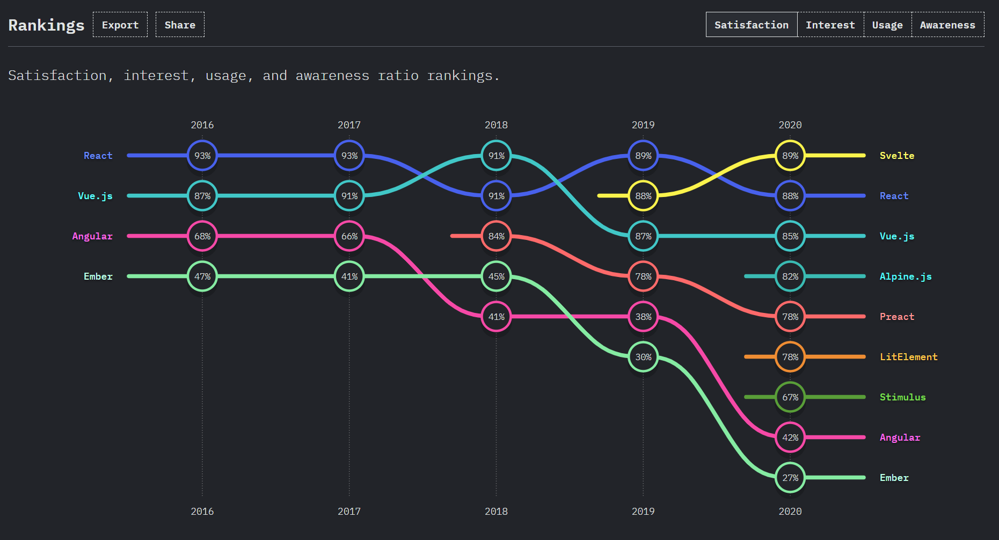

## Dealing with Conflict in Teams

<small>Presented by [Jamie McCrindle](https://jamie.mccrindle.org) / [@foldr](https://twitter.com/foldr)</small>

---

### Group Exercise 1

#### Apples vs Oranges

---

* Break out into rooms with 3 people
* Debate which is better - Oranges or Apples, 1 minute each
* One person is the adjudicator

---

### Discussion of Exercise 1

---

### Group Exercise 2

#### Apples and Oranges

---

* Break out into rooms with 3 people
* 1 minute each. First 30 seconds talk about what you have in common
    * Highlight what you like about the other fruit
* Last 30 seconds discuss why you prefer your fruit, use I prefer X because.
* One person is the adjudicator

---

### Discussion of Exercise 2

---

### Creating empathy

* Talk about what you have in common
* Highlight what you think is good about their position
* Use 'I prefer X because'

---

### Arguments typically only re-inforce people's positions

---

### Real World Example

#### Angular vs React

---

---

### Behavioral Interview Questions

---

_"Tell me about a time when you faced conflict within a team, and how you dealt with it"_

---

### Body Language

---

#### Body Language

|Open (Do's)|Closed (Don'ts)|
|-|-|
|Open arms|Closed arms|
|Eye Contact|Looking around / away|
|Upright posture|Slouched posture|
|Head nodding|No head movement|

---

#### Body Language

|Open (Do's)|Closed (Don'ts)|
|-|-|
|Standing appropriate distance|Standing too close or too far away|
|Smiling|Frowning|
|Set aside other work|Doing other work|

---

#### _Amazon Leadership Principle_
### Are Right, A Lot

Leaders are right a lot. They have strong judgment and good instincts. They seek diverse perspectives and work to disconfirm their beliefs.

---

### Use tenative language. Hedge.

'I think that X may be better than Y because' vs 'X is better than Y'

---

### Admit you're wrong quickly

You'll appear to be right more often

---

## Tips

---

### Have the conversation

If you think someone is upset, talk to them about it.

---

#### Add weight to your positions

e.g. I think the button would be better if it's blue but I don't feel too strongly about it

---

### Be factual. Be authentic.

---

### Assume good intent

---

### Give solutions

---

### Listen, withhold judgement.

---

### Yes and

Instead of 'No but'

---

### The power of 'I don't know'.

---

### Focus on outcomes

---

### How to take a compliment with this one simple trick

---

thanks.

---

### Questions